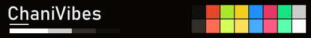
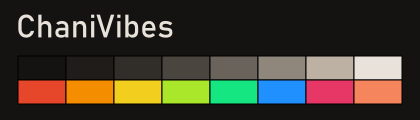
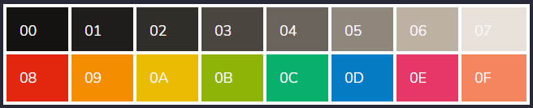
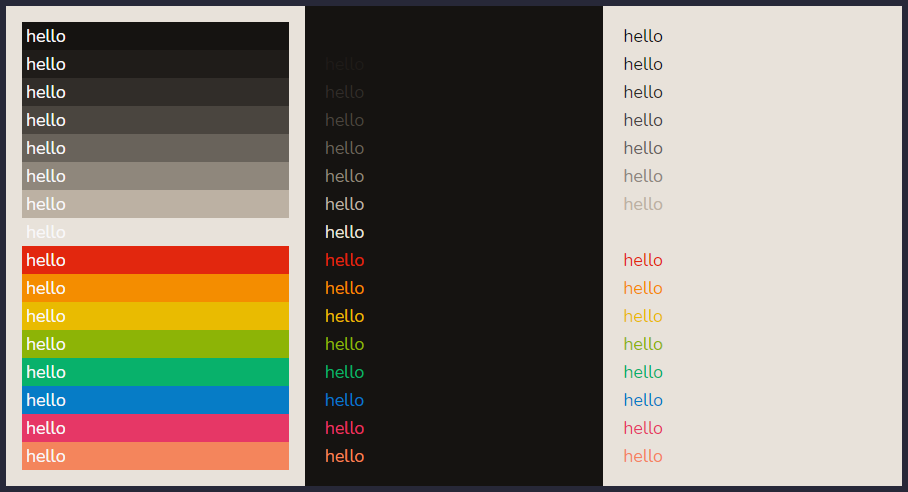

# ChaniVibes

**ChaniVibes** - colorful, bright, and versatile terminal & Base16 colorscheme.

## Terminal colorscheme

Available in:
- **_Xresources_**: [`ChaniVibes.Xresources`](ChaniVibes.Xresources)
- **_iTerm_**: [`ChaniVibes.itemcolors`](ChaniVibes.itemcolors)
- **_Windows Terminal_** colorschemes JSON: [`ChaniVibes-wt.json`](ChaniVibes-wt.json)

For another terminal/editor theme, feel free to customize on [terminal.sexy](https://terminal.sexy/) or through [termcolors](https://github.com/stayradiated/termcolors).

## Base16 theme

YAML [(chanivibes.yaml)](base16/chanivibes.yaml) | SASS/SCSS [(chanivibes.scss)](base16/chanivibes.scss)

Available for use with syntax highlighting. Perfect to use with your favourite text editors, IDE, and code previewer (rouge and highlight.js).

Color grid:

Color preview:

